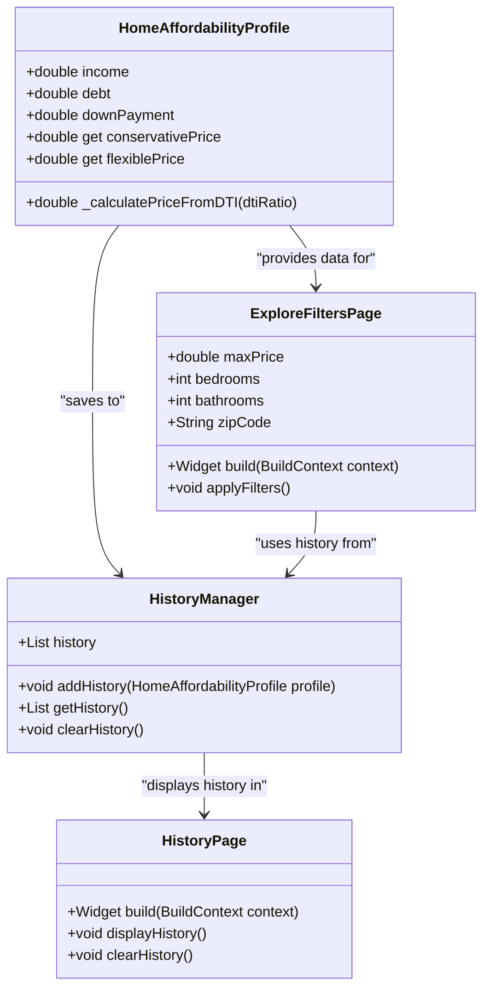

# Home Affordability Calculator

## Project Overview
This Flutter app helps users estimate the home price they can afford based on their monthly income, debt, and down payment. It also allows users to search for homes on Zillow using the calculated price and their ZIP code.

## Features
- **Home Affordability Estimator**: Calculates home price based on DTI ratio.
- **Zillow Integration**: Explore homes on Zillow based on affordability.
- **History**: View and manage previous calculations.

## UML Class Diagram

## How to Run the Application (2-3 paragraphs)
Prerequisites:
Flutter: Ensure you have Flutter installed. You can download it from Flutter’s official website.
Android Studio or Xcode: Install Android Studio for Android devices or Xcode for iOS devices.

STEP 1: 
Clone this repository:
git clone https://github.com/Badralmalahi1/home_affordability_calculator_flutter.git

STEP 2. Navigate to the project folder:
cd home_afford_flutter

STEP 3. Run the app:
flutter run

## Features

Home Affordability Estimator: Takes user input (income, debt, down payment) to calculate the maximum home price they can afford.

Zillow Integration: Redirects users to Zillow’s website with filters for their estimated price, bedrooms, bathrooms, and ZIP code.

History Tracking: Saves previous affordability calculations and allows users to view their history.

Professional UI: A clean, modern design with maroon-colored buttons, a background image, and professional animations.

## Testing the App (1 paragraph)
To test the app, simply run it on a connected device or simulator/emulator. The app will display a home affordability calculator, allowing users to enter their data and see the estimated price they can - afford. The history page will show past calculations, and the user can explore listings on Zillow based on their calculated affordability. Testing should ensure that all user inputs are handled properly, the calculations are accurate, and the Zillow integration works as expected.

## Challenges, Role of AI, and Insights (2-3 paragraphs)
One of the biggest challenges in this project was ensuring that the home affordability calculations were accurate and reflected real-world scenarios. I needed to account for various factors, such as the Debt-to-Income (DTI) ratio, and implement logic that allowed users to get an accurate idea of what they could afford. Another challenge was integrating with Zillow and ensuring that the search results matched the user's budget and criteria.

The use of AI played a role in optimizing code and troubleshooting issues, particularly with Flutter UI development and data flow management. I also learned a great deal about creating clean and efficient models in Flutter, separating business logic from the UI layer, and designing a user-friendly interface that meets practical requirements.

## Next Steps (1-2 paragraphs)
If I had more time, I would focus on improving the app's UI with more animations, transitions, and a more interactive design. Additionally, I would like to implement more advanced features such as integrating an external real estate API for more detailed listings and refining the algorithm for determining home affordability based on more detailed financial data. Future steps may also involve allowing users to save their favorite homes and track their home-buying journey in the app.

